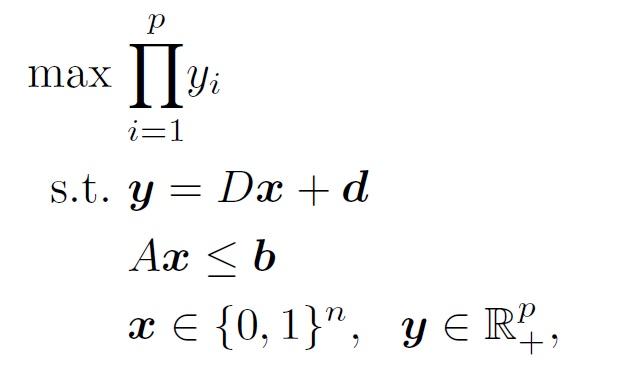
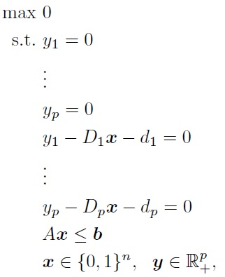

# Pure-binary-MMP-algorithm
An Algorithm for solving Pure Binary Integer Linear Maximum Multiplicative Programs 

This is an algorithm to solve a class of Pure Binary Integer Linear Maximum Multiplicative Programs of format:

where nc, nb, and ni represent the number of continuous, binary, and integer decision variables, respectively. Also, D is a p * n matrix where n:= nc+ nb + ni, d is a p-vector, A is an m * n matrix, and b is an m-vector.

This project is a Netbeans IDE 8.2 C++ project which was written in Linux (Ubuntu).

To compile the code, CPLEX (default version 12.7) must be installed on your computer. The default directory for CPLEX used is /opt/CPLEX/12.7/. Changing the directory of CPLEX to your preferred directory can be done either in the Makefile or through Netbeans. If you would like to do it in the Makefile you should go to nbproject/Makefile-Debug.mk and nbproject/Makefile-Release.mk and change all instances of /opt/CPLEX/12.7/ to your preferred directory. If you would like to do it through Netbeans, you can open the project in Netbeans and right click on the name of the project and choose Properties. You can then change the directory in the Include Directories box which is located in the C++ Compiler sub-menu. Moreover, you should also change the directory in the Libraries box which is located in the Linker sub-menu.

# Data Files
The instances used in the computational experiments of this algorithm are available in https://goo.gl/otpJwX.

For further instances, each data file should be written as a CPLEX LP file as follows,

where the first p x's are the objective functions respresenting the y1, y2,..., and yp of the problem, and the rest of x are the decision variables.

Our algorithm is only capable of solving instances without any integer variables. So, in order to implement the algorithm, convert all the integer variables to binaries.

In order to make our algorithm faster, it needs two input files; one is the instance file, and the other is the relaxed format of the instance, that is, the binary constraints should be eliminated in the second file. Binary constraints appear as "Binaries" at the end of the .lp file.

# Compiling and Running

Compiling the project can be done using the Terminal by going to the directory in which the project is saved and typing ”make clean” followed by ”make” (you can also compile through Netbeans).

An instance can be solved by typing 

./Algorithm <*address*>/<instance*> <*number of objective*>

where instance* is the original .lp file of the instance, instance** is the relaxed .lp file of the instance.

For better understanging, we have provided a folder named instance in the algorithm folder. In instance folder, 1.lp is the problems original file, and 2.lp is the relaxed form of the problem. In order to solve this instance, one can use the code

make clean

make

./Algorithm instance/1.lp instance/2.lp 2

# Supporting and Citing

The software in this ecosystem was developed as part of academic research. If you would like to help support it, please star the repository as such metrics may help us secure funding in the future. We would be grateful if you could cite:

[Ghasemi Saghand, P., Charkhgard, H., A criterion Space Search Algorithm for Mixed Integer Linear Maximum Multiplicative Programs: A Multi-objective Optimization Approach]
